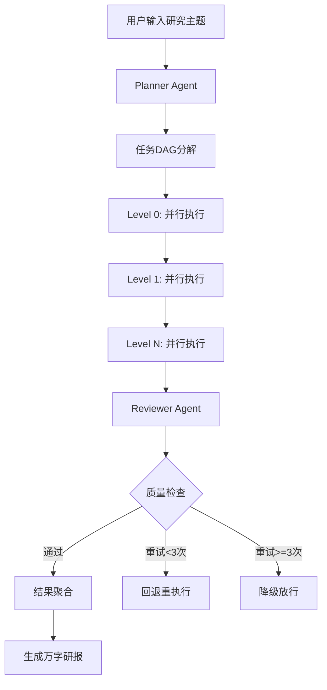

# 多Agent协作系统 - 企业级自动化研报与竞品情报分析系统

[](https://www.python.org/downloads/)
[](LICENSE)
[](https://langchain-ai.github.io/langgraph/)

## 系统概述

本系统是一个基于多Agent协作的企业级研报自动生成平台，能够根据用户输入的研究主题，自动完成数据采集、分析、整合，最终生成专业的万字深度研报。

### 核心价值

| 指标 | 人工模式 | Agent模式 | 提升幅度 |
|------|----------|-----------|----------|
| 单份研报耗时 | 3-5天 | 20-30分钟 | 95%↓ |
| 数据覆盖源 | 5-10个 | 50+个 | 500%↑ |
| 单份成本 | 5-10万 | 200-500元 | 99%↓ |

### 架构特点

- **DAG依赖执行**：基于拓扑排序的层级并行执行
- **熔断降级**：Reviewer质量审核带熔断机制
- **MCP工具集成**：标准化的工具调用协议
- **状态持久化**：LangGraph Checkpointer + Redis分布式锁

## 快速开始

### 环境要求

- Python 3.11+
- Redis 7.0+
- PostgreSQL 15+
- Docker & Docker Compose (可选)

### 本地开发

```bash
# 1. 克隆项目
git clone <repo-url>
cd multi-agent-collaboration-system

# 2. 创建虚拟环境
python -m venv .venv
source .venv/bin/activate  # Linux/Mac
# .venv\Scripts\activate   # Windows

# 3. 安装依赖
make install
# 或
pip install -r requirements.txt

# 4. 配置环境变量
cp .env.example .env
# 编辑 .env 填入实际配置

# 5. 启动服务
make run
```

### Docker部署

```bash
# 构建并启动所有服务
make docker-build
make docker-up

# 查看日志
make docker-logs

# 停止服务
make docker-down
```

## 项目结构

```
multi-agent-collaboration-system/
├── src/                          # 源代码
│   ├── main.py                   # FastAPI应用入口
│   ├── config.py                 # 配置管理
│   ├── models/                   # 数据模型
│   ├── agents/                   # Agent实现
│   │   ├── planner.py           # 任务规划Agent
│   │   ├── executor.py          # 任务执行Agent
│   │   └── reviewer.py          # 质量审核Agent
│   ├── orchestrator/            # LangGraph编排引擎
│   ├── state/                   # 状态管理
│   ├── communication/           # 通信层
│   ├── tools/                   # MCP工具集成
│   └── api/                     # API路由
├── mcp-servers/                 # MCP工具服务器
│   ├── search-server/           # 搜索服务
│   ├── financial-server/        # 金融数据服务
│   └── cleaner-server/          # 数据清洗服务
├── tests/                       # 测试代码
├── k8s/                         # Kubernetes配置
├── docs/                        # 文档
└── scripts/                     # 脚本工具
```

## 核心流程



## API文档

启动服务后访问：
- Swagger UI: http://localhost:8000/docs
- ReDoc: http://localhost:8000/redoc

### 主要接口

```bash
# 提交研报任务
POST /api/v1/reports
{
  "topic": "2026年中国新能源汽车市场格局分析",
  "priority": "high"
}

# 查询任务状态
GET /api/v1/reports/{task_id}

# WebSocket进度推送
WS /ws/reports/{task_id}
```

## 测试

```bash
# 运行所有测试
make test

# 运行单元测试
make test-unit

# 运行集成测试
make test-integration

# 代码检查
make lint

# 代码格式化
make format
```

## 部署

详见 [部署文档](docs/deployment.md)

### Kubernetes部署

```bash
# 创建命名空间
kubectl apply -f k8s/namespace.yaml

# 部署配置
kubectl apply -f k8s/configmap.yaml

# 部署服务
kubectl apply -f k8s/deployment.yaml
kubectl apply -f k8s/service.yaml
```

## 文档

- [架构设计](docs/architecture.md)
- [API文档](docs/api.md)
- [部署指南](docs/deployment.md)
- [开发指南](docs/development.md)

## 技术栈

- **编排引擎**: LangGraph
- **LLM**: OpenAI GPT-4o
- **后端框架**: FastAPI
- **状态存储**: PostgreSQL + Redis
- **工具协议**: MCP (Model Context Protocol)
- **监控**: Langfuse + Prometheus
- **部署**: Docker + Kubernetes

## License

MIT License
