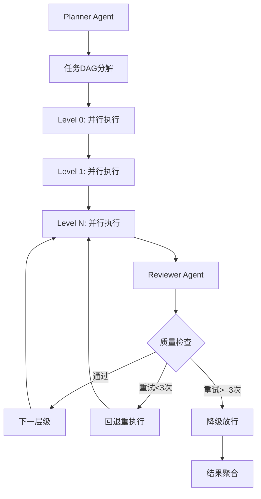

# 架构设计文档

## 1. 系统概述

本系统是一个基于多Agent协作的企业级研报自动生成平台，采用Planner-Executor-Reviewer三层架构，通过LangGraph状态机驱动内部流转，MCP协议集成外部工具。

## 2. 核心架构

### 2.1 分层架构

```
┌─────────────────────────────────────────────────────────────┐
│  接入层    │   FastAPI Gateway + WebSocket实时通信          │
├─────────────────────────────────────────────────────────────┤
│  编排层    │   LangGraph StateGraph + 条件边路由            │
├─────────────────────────────────────────────────────────────┤
│  协作层    │   Planner-Executor-Reviewer三层架构            │
├─────────────────────────────────────────────────────────────┤
│  状态层    │   LangGraph Checkpointer + Redis分布式锁      │
├─────────────────────────────────────────────────────────────┤
│  工具层    │   MCP Client → MCP Servers                    │
├─────────────────────────────────────────────────────────────┤
│  通信层    │   EventBus (仅外部广播)                       │
└─────────────────────────────────────────────────────────────┘
```

### 2.2 职责边界

| 组件 | 职责 | 不负责 |
|------|------|--------|
| **LangGraph StateGraph** | 驱动内部状态流转、条件路由、重试控制 | 不负责外部通信 |
| **EventBus / WebSocket** | 向前端广播进度、状态变更 | 不参与内部任务调度 |
| **LangGraph Checkpointer** | 持久化图状态快照，支持断点续传 | 不负责分布式锁 |
| **Redis** | 分布式Worker认领锁、子任务状态缓存 | 不负责图状态持久化 |

## 3. 核心流程

### 3.1 DAG依赖执行



### 3.2 关键机制

1. **拓扑排序**：基于Kahn算法，输出按层级分组的任务ID
2. **层级并行**：同一层级的任务并行执行，不同层级串行执行
3. **依赖检查**：执行前检查前置依赖是否全部完成
4. **熔断降级**：达到最大重试次数后降级放行，防止无限重试

## 4. 状态管理

### 4.1 LangGraph Checkpointer

- 存储：图状态快照（AgentState）
- 用途：断点续传、状态恢复、调试回溯
- 实现：PostgreSQL持久化

### 4.2 Redis分布式锁

- 存储：任务认领锁
- 用途：Worker认领防并发
- 实现：Lua脚本原子操作

## 5. 工具集成

### 5.1 MCP协议

- **MCP Client**：Executor Agent通过MCP Client调用外部工具
- **MCP Server**：独立部署的工具服务（搜索、金融、清洗）
- **异常处理**：连接失败、超时、限流等异常的重试和降级

### 5.2 可用工具

| 工具 | 服务 | 功能 |
|------|------|------|
| web_search | search-mcp | 网页实时搜索 |
| financial_api | financial-mcp | 金融数据查询 |
| data_cleaner | cleaner-mcp | 数据清洗格式化 |
| sentiment_analyzer | cleaner-mcp | 舆情分析 |
| chart_generator | cleaner-mcp | 图表生成 |

## 6. 通信架构

### 6.1 EventBus

- 职责：仅用于外部广播
- 事件类型：plan_created, level_executed, level_reviewed, report_completed
- 不参与内部任务调度

### 6.2 WebSocket

- 职责：向前端实时推送进度
- 协议：JSON格式消息
- 连接管理：按task_id分组

## 7. 部署架构

### 7.1 Docker Compose

- 单机部署，适合开发和测试
- 服务：api-gateway, mcp-servers, redis, postgres

### 7.2 Kubernetes

- 集群部署，适合生产环境
- 支持水平扩展、负载均衡、健康检查
